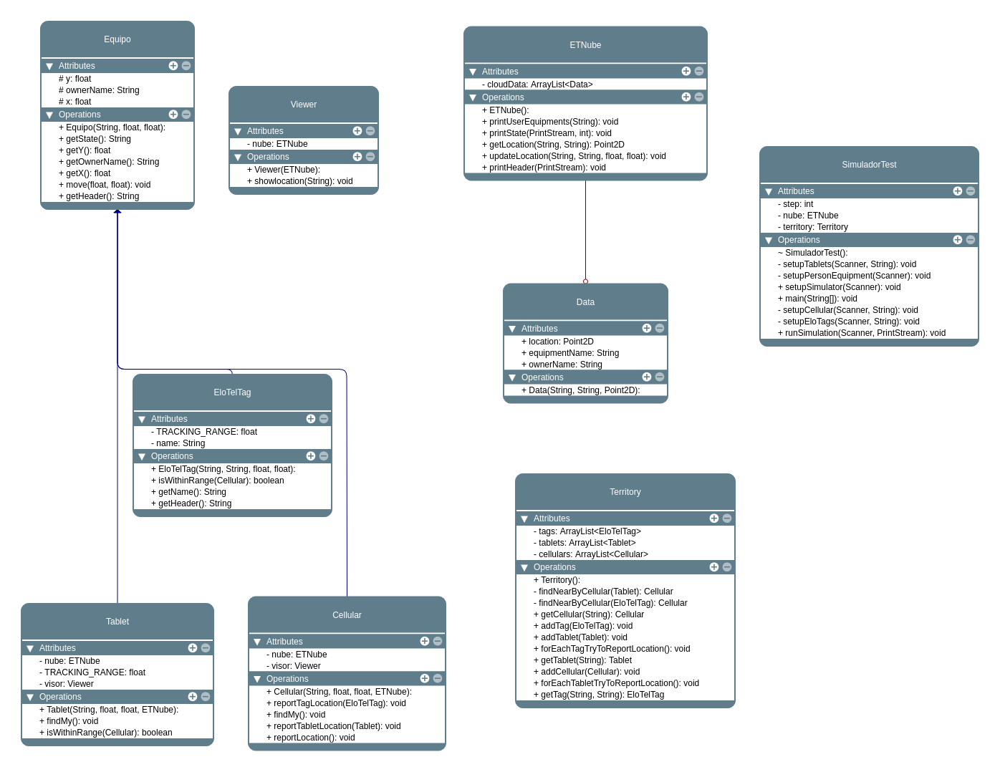

# Documentación Tarea 1 - ELO329
### Grupo 6 - 2025.1 - Par. 200
- Alejandro Díaz (Rol: 202430529-8)
- Álvaro Leal (Rol: 202430548-4)
- Pablo Rodríguez (Rol: 202430541-7)
- Sebastián Saldías (Rol: 202430534-4)

## Aclaraciones
Realizamos la etapa 5 (extra) de la tarea, sin embargo, esta documentación solo abarca hasta la etapa 4 de la tarea, acorde a lo establecido en las instrucciones de la tarea.

Se ha comprobado el funcionamiento del programa en remoto Aragorn exitosamente.

En el repositorio [GitHub](https://github.com/disco-japi/ELO239) del grupo, puede encontrar también las demás tareas del semestre, y revisar los cambios acorde al tiempo de la tarea.
## Implementaciones:
- **Dispositivos**: EloTelTag, Celular,Tablet
- **Nube de localización (ETNube)** que registra posiciones
- Comando **FindMy** para visualizar equipos de una persona

## 

## Diagrama de clases

## Referencia de clases
A continuación, se presenta la referencia de clases del programa.

### Equipo

**Descripción:** Clase de un equipo genérico que sirve como base para los dispositivos del sistema.

- **Herencia:** Clase base.
    
- **Responsabilidades:** Almacena el nombre del dueño (`ownerName`) y las coordenadas espaciales (x, y). Proporciona métodos para obtener la ubicación, mover el equipo y formatear su estado para salida de datos.
    

### EloTelTag

**Descripción:** Clase del tag que representa un rastreador de proximidad.

- **Herencia:** Hereda de `Equipo`.
    
- **Responsabilidades:** Posee un nombre de dispositivo específico y un rango de seguimiento definido (`TRACKING_RANGE = 10.0`). Incluye lógica para verificar si se encuentra dentro del rango de alcance de un celular mediante el cálculo de distancia euclidiana.
    

### Cellular

**Descripción:** Dispositivo localizable con GPS propio.

- **Herencia:** Hereda de `Equipo`.
    
- **Responsabilidades:** Actúa como puente hacia la nube (`ETNube`). Reporta su propia ubicación, así como la ubicación de tags y tablets que se encuentren dentro de su rango. Incluye la funcionalidad `findMy` para visualizar dispositivos a través de un `Viewer`.
    

### Tablet

**Descripción:** Dispositivo localizable sin GPS propio.

- **Herencia:** Hereda de `Equipo`.
    
- **Responsabilidades:** Similar al celular en cuanto a visualización (`findMy`), pero depende de dispositivos externos para reportar su ubicación a la nube. También define un `TRACKING_RANGE` para verificar su proximidad a un celular.
    

### ETNube

**Descripción:** Clase de simulación del servicio en la nube ETNube para la localización de equipos.

- **Herencia:** Ninguna (Clase independiente).
    
- **Responsabilidades:** Gestiona una base de datos interna (`ArrayList<Data>`) que registra la última ubicación conocida de cada dispositivo. Ofrece métodos para actualizar localizaciones, consultar datos por usuario y generar reportes formateados para el simulador.
    

### Territory

**Descripción:** Territorio virtual donde los celulares, tags y tablets se localizan y se mueven.

- **Herencia:** Ninguna (Clase independiente).
    
- **Responsabilidades:** Contiene las colecciones de todos los dispositivos físicos en la simulación. Gestiona la interacción de proximidad entre ellos, permitiendo que los celulares detecten y reporten la ubicación de tags y tablets cercanos a la nube.
    

### Viewer

**Descripción:** Visualiza los datos en consola.

- **Herencia:** Ninguna (Clase independiente).
    
- **Responsabilidades:** Actúa como interfaz de salida para el usuario. Accede a la información almacenada en `ETNube` para imprimir en consola el estado y la ubicación de los equipos asociados a una persona específica.
    

### SimuladorTest

**Descripción:** Clase principal del simulador.

- **Herencia:** Ninguna (Clase principal).
    
- **Responsabilidades:** Orquestra la ejecución del programa. Se encarga de leer los archivos de configuración y movimientos, instanciar los objetos necesarios en el `Territory` y ejecutar los pasos de la simulación, procesando tanto desplazamientos físicos como comandos de búsqueda (`FindMy`).